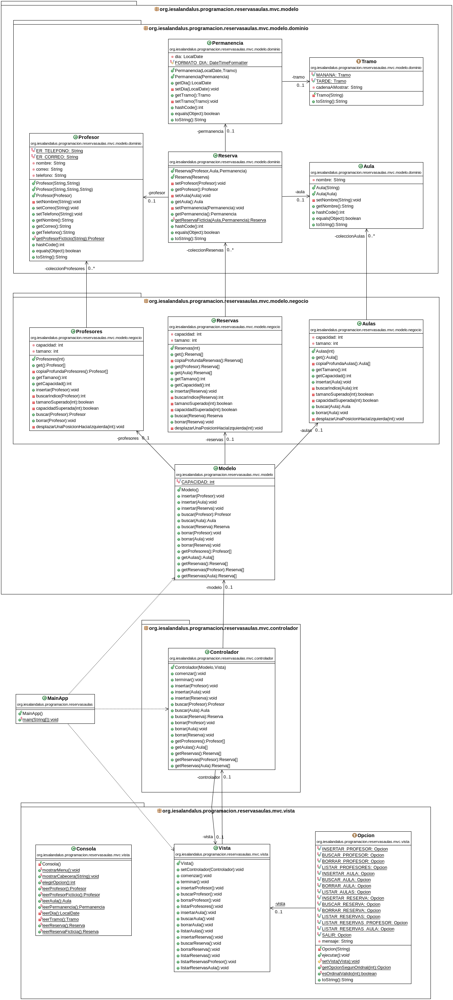

# Ejemplo Tarea: Reservas de Aulas
## Profesor: José Ramón Jiménez Reyes

Desde el IES Al-Ándalus nos han encargado realizar una aplicación para la gestión de reservas de aulas del IES Al-Ándalus. Después de todas las especificaciones y requerimientos anotados, en este **primer spring** de la aplicación se ha decidido abarcar los siguientes:

- Hay unas aulas que se pueden reservar. Por tanto, un **aula** será identificada por su **nombre**, el cuál no puede estar vacío y tampoco se puede modificar dicho nombre una vez creada. Podremos crear nuevas aulas (siempre que no exista otra aula con el mismo nombre), borrarlas, buscar aulas por su nombre y listar las aulas.
- Los profesores podrán realizar reservas. Un **profesor** se identifica por su **nombre**, su **correo electrónico** (que debe ser correcto) y su **teléfono** (que también debe ser correcto). El teléfono puede proporcionarlo el profesor o no. Si lo indica será una cadena de 9 dígitos y siempre debe comenzar por 6 o 9. Si no lo indica, no se asociará ningún teléfono a dicho profesor. Una vez creado un profesor no se le podrá cambiar el nombre, pero sí se podrá cambiar su correo o su teléfono, pudiendo ser este último vacío. Podremos añadir nuevos profesores (siempre que no exista otro profesor con el mismo nombre), borrarlos, buscar profesores por su nombre y listar los profesores dados de alta. Consideramos que dos profesores son los mismos si su correo electrónico es el mismo.
- En este primer spring sólo se podrá reservar un aula para una **permanencia** de un **día** y para el **tramo** de mañana o tarde. Consideramos que dos reservas son iguales si el aula y la permanencia son iguales.
- Un **profesor** podrá **reservar** un **aula** para una **permanencia** dada. No se llevará a cabo la reserva si para dicha permanencia y aula ya hay otra reserva dada de alta. No se podrá reservar una aula si el profesor no existe o si el aula no exste. También podremos anular una reserva, buscar una reserva para un aula  permanencia dada y listar todas las reservas existentes. También podremos listar las reservas que ha realizado un profesor y listar las reservas de un aula dada. Sólo se llevará a cabo la reserva si el profesor y el aula existen.

Tu tarea consiste en realizar una aplicación para gestionar la reserva de aulas para el IES Al-Ándalus. Con los conocimientos adquiridos hasta el momento realizaremos una implementación basada en arrays para gestionar las colecciones. Aunque aún no tenemos los conocimientos necesarios para aplicar el patrón MVC, sí haremos una distinción entre la vista (encargada de interaccionar con el usuario), el modelo (encargado de gestionar los datos) que dividiremos entre clases del dominio y las clases de negocio que nos permiten interactuar con las colecciones y el controlador que se encarga de orquestar la interacción entre vista y controlador.

Debes tener en cuenta el problema existente con las referencias, por lo que para cada clase que sea cliente de otra deberás devolver referencias a objetos nuevos en los métodos de acceso y también crear nuevas referencias a nuevos objetos cuando los vayamos a asignar a atributos. En los métodos de las clases de negocio también deberás devolver una copia profunda de los elementos de la colección en dicho método de acceso.

También siempre se deben validar todas los valores que se intentan asignar y si no lanzar una excepción adecuada para evitar inconsistencias en el estado de los objetos.

Ten en cuenta que el proyecto lleva todos los test que espero que se pasen.

Se propone seguir el siguiente diagrama de clases:

Cuenta conmigo para cualquier duda que te pueda surgir o cualquier errata que puedas encontrar.

